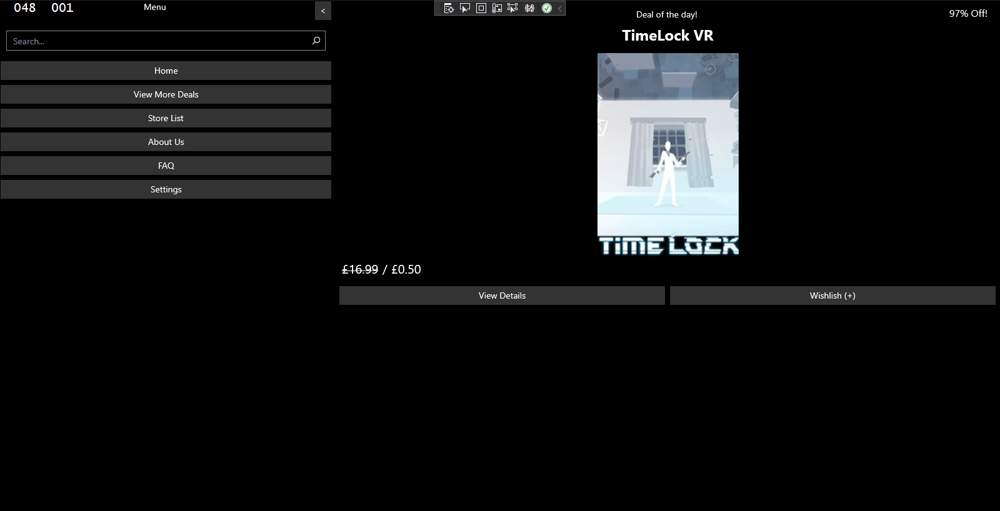

    
  </a>

  <h3 align="center">csApiApp</h3>

  

    Short description
     
    <a href="https://reponame/issues/new?template=bug.md">Report bug</a>
    ·
    <a href="https://reponame/issues/new?template=feature.md&labels=feature">Request feature</a>
  

## Table of contents

- [Table of contents](#table-of-contents)
- [Example Image](#example-image)
- [Quick start](#quick-start)
- [Status](#status)
- [Bugs and feature requests](#bugs-and-feature-requests)
- [Contributing](#contributing)
- [Creators](#creators)
- [Copyright and license](#copyright-and-license)

## Example Image

## Quick start

Some text

- Instruction 1
- Instruction 2
- Instruction 3

## Status

## Bugs and feature requests

Have a bug or a feature request? Please first read the [issue guidelines](https://reponame/blob/master/CONTRIBUTING.md) and search for existing and closed issues. If your problem or idea is not addressed yet, [please open a new issue](https://reponame/issues/new).

## Contributing

Please read through our [contributing guidelines](https://reponame/blob/master/CONTRIBUTING.md). Included are directions for opening issues, coding standards, and notes on development.

Moreover, all HTML and CSS should conform to the [Code Guide](https://github.com/mdo/code-guide), maintained by [Main author](https://github.com/usernamemainauthor).

Editor preferences are available in the [editor config](https://reponame/blob/master/.editorconfig) for easy use in common text editors. Read more and download plugins at <https://editorconfig.org/>.

## Creators

**Creator 1**

- <https://github.com/usernamecreator1>

## Copyright and license

