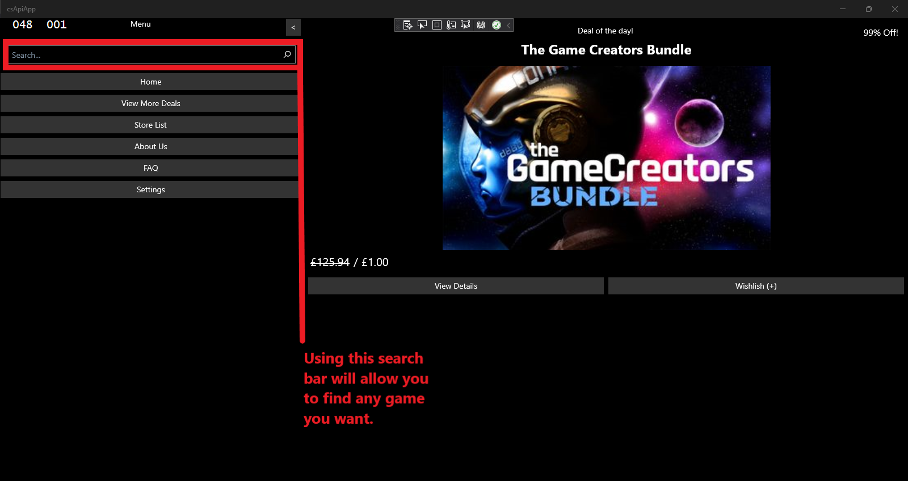

  <h3 align="center">csApiApp</h3>

  

    Short description
     
    <a href="https://github.com/CMCSHE201/CheapShark_API_App/issues/new?template=bug.md">Report bug</a>
    ·
    <a href="https://github.com/CMCSHE201/CheapShark_API_App/issues/new?template=feature.md&labels=feature">Request feature</a>
  

## Table of contents

- [Table of contents](#table-of-contents)
- [Example Image](#example-image)
- [Quick start](#quick-start)
- [Status](#status)
- [Bugs and feature requests](#bugs-and-feature-requests)
- [Contributing](#contributing)
- [Creators](#creators)
- [Copyright and license](#copyright-and-license)

## Example Image

## Quick start

On the home page as you load the application, the best deal found at the time will be displayed. The normal price, sale price and the sale percentage are shown, and clicking the left button below the image will either bring you to a page displaying more details or by clicking the right button, this game will be added to your wishlist to view again later.

The application features a search bar so you can search for any game and the best deals for any results found will be displayed. Clicking on the displayed search result will bring you to a page displaying more details about the game.

By clicking on the ‘View More Deals’ button, you will be brought to a page where the best deals found at the time of use and will display them in a list of results. Clicking these results will display more details about the game such as the store the deal was found on and any ratings the game has online.

The ‘Store List’ button will show all the available online stores that are used to find the best deals. Examples of these are Steam, Amazon, Origin and more. The display will also show whether the store is currently active for use or not.

The ‘FAQ’ button can be used to answer some possible questions that you may have whilst using the application. Any other issues that are not shown in this page can be sent through GitHub and will be resolved as soon as possible.

Clicking the ‘Settings’ button will allow you to modify the application to your preference. This can be through changing the theme and other modifications.

## Status

## Bugs and feature requests

Have a bug or a feature request? [please open a new issue](https://github.com/CMCSHE201/CheapShark_API_App/issues/new).

## Contributing

## Creators

## Copyright and license

